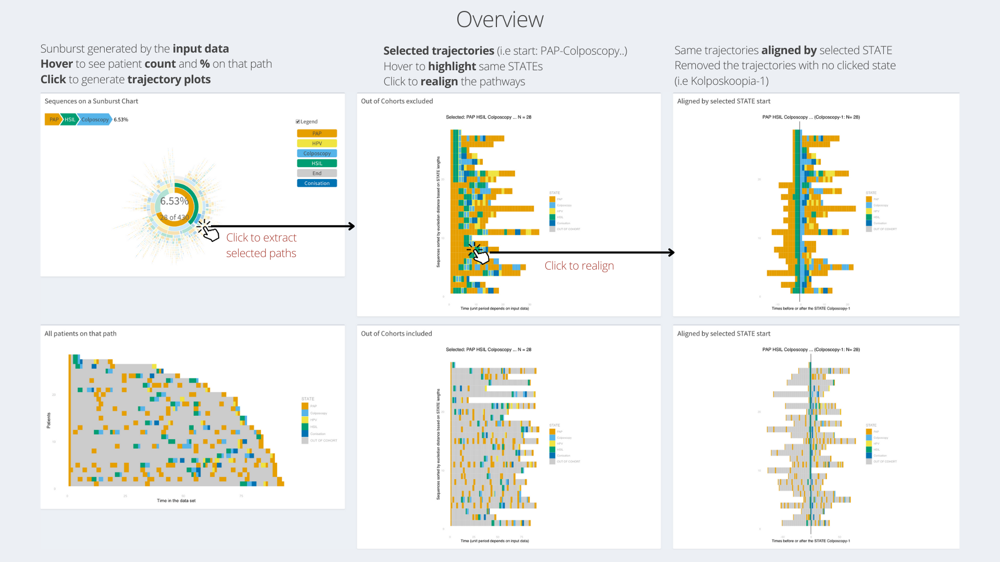
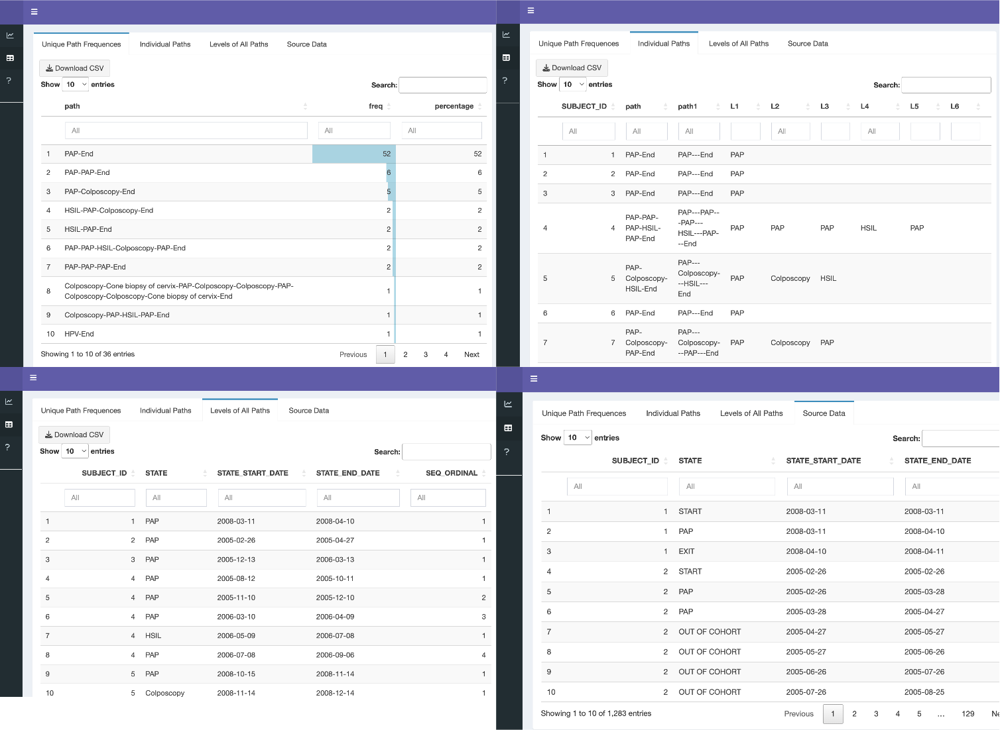
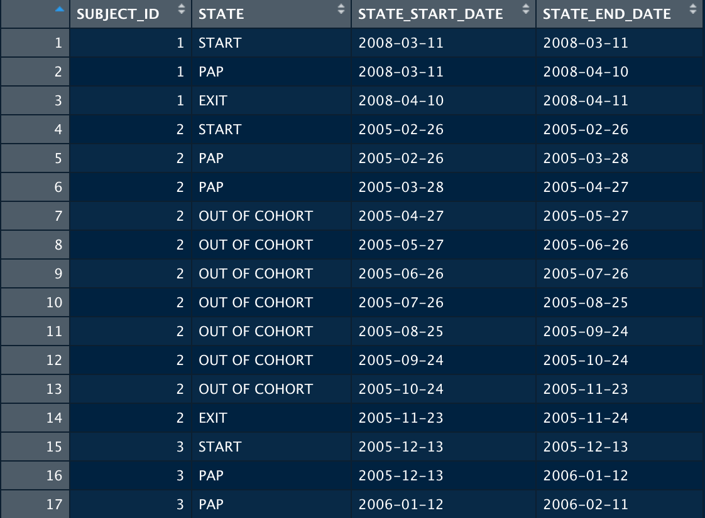

```{r, include = FALSE}
knitr::opts_chunk$set(
  collapse = TRUE,
  comment = "#>",
  fig.path = "man/figures/README-",
  out.width = "100%"
)
```

# About TrajectoryViz

TrajectoryViz is an R package for visualizing patient level event sequences, to complement the sunburst plot based analyses. The patient level sequences can be filtered, shown with the gaps or without, and aligned by different events. All these visualisations are interactive allowing both quantifying the interesting aspects or zooming into interesting patterns. To make the visualization compatible with any OMOP formatted database TrajectoryViz relies on Cohort2Trajectory package in R.   

## The dashboard

```{r, echo=FALSE, fig.cap="The overview of dashboard.", out.width = '100%'}
library(knitr)

```


## Tables

```{r, echo=FALSE, fig.cap="Tables generated.", out.width = '100%'}
library(knitr)

```


## Example of a data set file

```{r, echo=FALSE, fig.cap="Example dataset.", out.width = '50%'}
library(knitr)

```


## Installation

You can install TrajectoryViz:
https://github.com/HealthInformaticsUT/TrajectoryViz.
Run with function: 
trajectoryViz().
Get your data with Cohort2Trajectory (by Markus Haug) as described in its documentation at:
https://github.com/HealthInformaticsUT/Cohort2Trajectory.

``` r
library(TrajectoryViz)
trajectoryViz()
```
Data files 
Default size limit in RStudio is 5MB a file. If needed to resize, run in the console before executing the Shiny (example size):

``` r
options(shiny.maxRequestSize = 20 * 1024^2)
```

