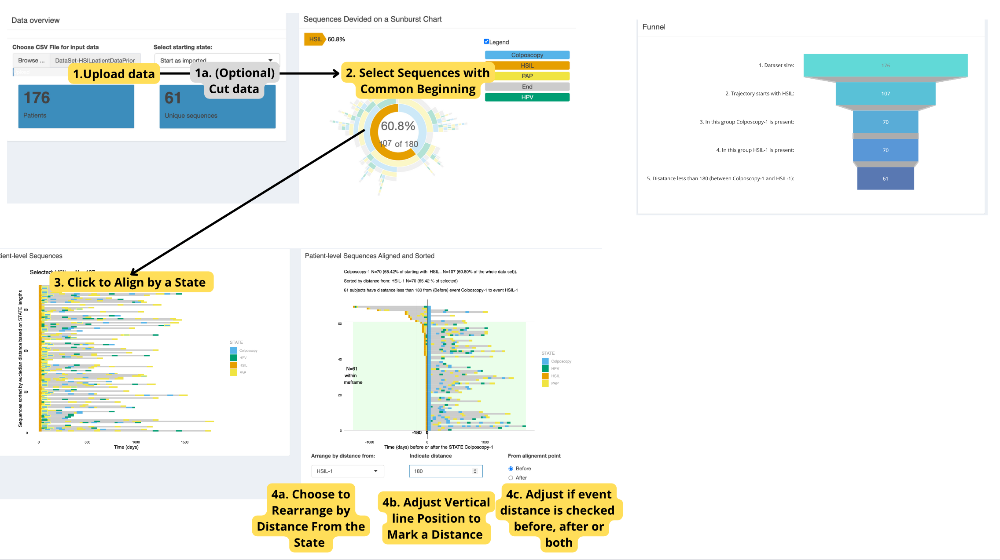
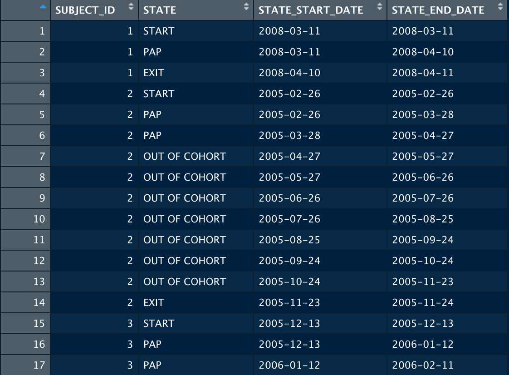

# About TrajectoryViz

TrajectoryViz is an R package for visualizing patient level event
sequences, to complement the sunburst plot based analyses. The patient
level sequences can be filtered, shown with the gaps or without, and
aligned by different events. All these visualisations are interactive
allowing both quantifying the interesting aspects or zooming into
interesting patterns. To make the visualization compatible with any OMOP
formatted database TrajectoryViz relies on Cohort2Trajectory package in
R.

## The dashboard

<div class="figure">


<p class="caption">
The overview of dashboard.
</p>

</div>

## Tables

<div class="figure">


<p class="caption">
Tables generated.
</p>

</div>

## Example of a data set file

<div class="figure">


<p class="caption">
Example dataset.
</p>

</div>

## Installation

You can install TrajectoryViz:
<https://github.com/HealthInformaticsUT/TrajectoryViz>. Run with
function: trajectoryViz(). Get your data with Cohort2Trajectory (by
Markus Haug) as described in its documentation at:
<https://github.com/HealthInformaticsUT/Cohort2Trajectory>.

``` r
library(TrajectoryViz)
trajectoryViz()
```

Data files Default size limit in RStudio is 5MB a file. If needed to
resize, run in the console before executing the Shiny (example size):

``` r
options(shiny.maxRequestSize = 20 * 1024^2)
```

### License

TrajectoryViz is licensed under Apache License 2.0

### Development

TrajectoryViz is being developed in R Studio. The maintainer:
<maarja.pajusalu@ut.ee>

### Citation

Pajusalu, M. (2024, March). TrajectoryViz, v1.0. GitHub.
<https://github.com/HealthInformaticsUT/TrajectoryViz>

### Acknowledgements

Research group of Health-Informatics in University of Tartu
<https://health-informatics.cs.ut.ee/>
