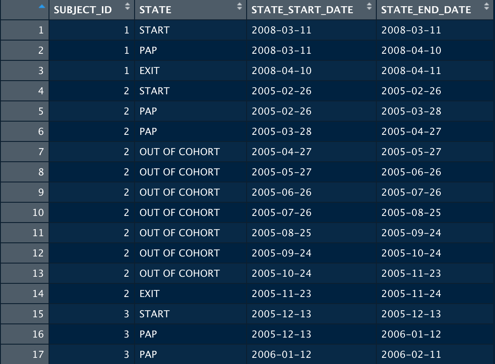
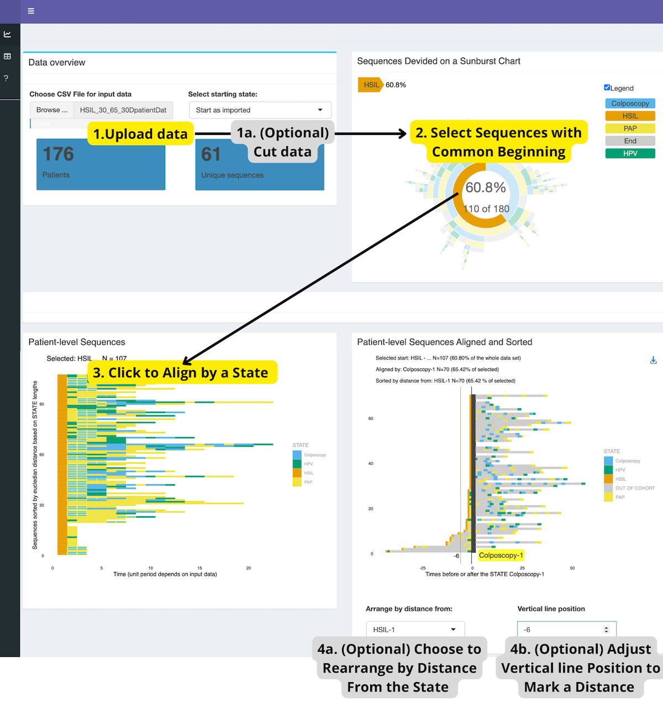

```{r setup, include=FALSE}
knitr::opts_chunk$set(
  collapse = TRUE,
  comment = "#>"
)
```

## Introduction

This vignette describes how to run the package and use it with example dataset [provided at Github](https://github.com/HealthInformaticsUT/TrajectoryViz).
To install the package, go to [GitHub repository](https://github.com/HealthInformaticsUT/TrajectoryViz) and install locally.
TrajectoryViz package relies on [Cohort2Trajectory](https://github.com/HealthInformaticsUT/Cohort2Trajectory) for trajectory data preparation from Atlas into discrete time periods.

The package has been developed with following example use case in mind: 
• We have access to patient-level treatment trajectories and we can transform those into discrete or continuous sequences (with Cohort2Trajectory).
• We would like to visualize proportions of similar sequences in the population (cohort, data set).
• We would like to visualize selected sequences on detailed level with or without time gaps between defined events (a lab test, days/months inbetween, a result, days/months inbetween, a procedure etc).
These events are called STATES in this package.
• We would like to be able to align sequences by selected state (event) to see period lengths before and after selected state.

```{r, echo=FALSE, fig.cap="Example dataset.", out.width = '50%'}
library(knitr)

```

## Running the package

Running the function "TrajectoryViz" (named the same as the package itself) opens a Shiny dashboard to start with uploading the input data.
In the "Tables" menu 4 tabs of data present the Source data table and Frequences, Levels and Paths which have been created while running the function to be able to generate the following plots.
In the "Info" menu the 2 tabs describe the package usage.

```{r TrajectoryViz, include = TRUE, eval = FALSE}
# library(TrajectoryViz)
TrajectoryViz::TrajectoryViz()
```

Optionally the data can be cut from the start in order to have same State (i.e procedure, diagnoses) as the starting point for all sequences in the data set that do have the selected state.

The sunburst diagram generated visualises the whole data set showing all sequences grouped by the similar states on levels.
Sunburst diagram is interactively showing the proportions of the data set that belong to the group hovered on.
• CLICK on a segment to select all individual paths or sequences on that group.
All the sequences will be plotted as lines colored by the states.
Each row represents 1 patient that has experienced the selected sequence (drugs, procedures, diagnoses according to the input file STATEs).
"Out of cohort" periods (time gaps inbetween states) have been removed.
• Click on a State to align the sequences by that state.
• Optional: Select a state to use for sorting by distance from that state.
This will also filter out some sequences if they dont have the state selected for distance sorting.
• Optional: To better spot the time periods, set the position for vertical line to visualise the time before or after alignment point.

```{r, echo=FALSE, fig.cap="The dashboard with example data.", out.width = '100%'}
library(knitr)

```
